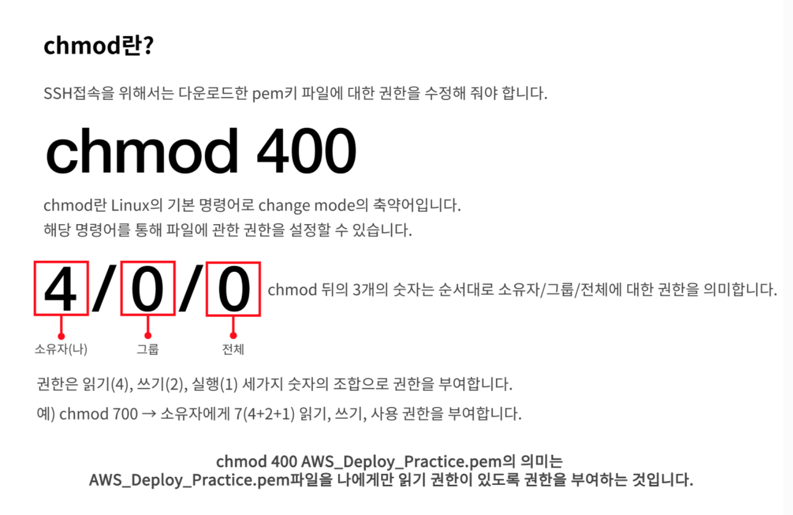

# EC2

## EC2 인스턴스 연결

원격접속을 통해 내 앞에 있지 않은 PC를 사용할 수 있다. 이 때 필요한 것이 인스턴스를 생성할 때 다운로드 한 키 페어 파일(.pem)이다. "우리가 약속했던 Key로 접속할게!"

이제 SSH 연결을 통해서 인스턴스에 접속해 보자

## SSH란?

SSH란 Secure Shell Protocol, 즉 네트워크 프로토콜 중 하나로 컴퓨터와 컴퓨터가 인터넷과 같은 Public Network를 통해 서로 통신을 할 때 보안적으로 안전하게 통신을 하기 위해 사용하는 프로토콜이다. 대표적인 사용의 예는 다음과 같다.

1. 데이터 전송 (ex: GitHub)
   소스 코드를 원격 저장소인 깃헙에 푸쉬할 때 여러분은 SSH를 활용해 파일을 전송하게 된다.
2. 원격 제어 (ex: AWS)
   AWS의 인스턴스 서버에 접속하여 해당 머신에 명령을 내리기 위해서도 SSH를 통한 접속을 해야 한다.

### SSH 그래서 왜 쓰나요?

FTP나 Telnet과 같은 다른 컴퓨터와 통신을 위해 사용되는 프로토콜도 있는데 SSH를 사용하는 이유는 **"보안"** 때문이다. 만일 예로 언급한 두 프로토콜을 통해 민감한 정보(예를 들어 로그인 정보)를 주고받는다면 정보를 직접 네트워크를 통해 넘기기 때문에 누구나 해당 정보를 열어볼 수 있어 보안에 상당히 취약하다.

반면 SSH는 먼저 보안적으로 훨씬 안전한 채널을 구성한 뒤 정보를 교환하기 때문에 보다 보안적인 면에서 훨씬 뛰어나다.

> 그렇다면 SSH는 어떤 방식으로 서로 다른 컴퓨터가 안전하게 통신하게끔 할까?

### Private Key와 Public Key

SSH는 다른 컴퓨터와 통신을 하기 위해 접속을 할 때 우리가 일반적으로 사용하는 비밀번호의 입력을 통한 접속을 하지 않는다.
기본적으로 SSH는 한 쌍의 Key를 통해 접속하려는 컴퓨터와 인증 과정을 거치게 된다.

이 한 쌍의 Key는 다음과 같다.

- Private Key
  - 절대로 외부에 노출이 되어서는 안되는 Key로 본인의 컴퓨터 내부에 저장하게 되어있다.
  - 암호화된 메시지를 복호화 할 수 있다
- Public Key
  - 공개되어도 비교적 안전한 Key
  - 메시지를 전송하기 전 암호화를 한다.
  - 암호화는 가능하지만 복호화는 불가능하다.

이렇게 한 쌍의 Public Key와 Private Key는 서로 매우 복잡한 수학적인 관계를 맺고 있다.

이러한 Private Key와 Public Key를 통해 다른 컴퓨터와 통신을 하기 위해서는 먼저 Public Key와 통신을 하고 컴퓨터에 복사하여 저장한다. 그리고 요청을 보내는 클라이언트 사이드 컴퓨터에서 접속 요청을 할 때 응답을 하는 서버 사이드 컴퓨터에 복사되어 저장된 Public Key와 클라이언트 사이드에 해당 Public Key와 쌍을 이루는 Private Key와 비교를 하여 서로 한 쌍의 Key인지 아닌지를 검사한다.

이렇게 서로 관계를 맺고 있는 Key라는 것이 증명이 되면 비로소 두 컴퓨터 사이에 암호화된 채널이 형성이 되어 Key를 활용해 메시지를 암호화하고 복호화하며 데이터를 주고 받을 수 있게 된다.

## 인스턴스에 연결

다시 인스턴스에 연결하는 걸로 돌아오자면, 로컬 터미널에서 SSH프로토콜을 이용해서 인스턴스와 연결이 가능하다. 하지만 먼저 다운로드했던 키 페어 파일(.pem)의 권한을 수정해 줘야 한다. pem 파일에 누구나 접근할 수 있는 권한이 부여되어 있다면 인스턴스는 연결을 거부한다.

1. SSH 클라이언트를 연다
2. 프라이비 키 파일을 찾는다
3. 키를 공개적으로 볼 수 없도록 한다 // chmod 400 pem파일 이름
4. 퍼블릭 DNS를 사용하여 인스턴스에 연결

- [SSH로 인스턴스 연결 도중 만난 오류 해결 방법](https://velog.io/@usreon/SSH%EB%A1%9C-%EC%9D%B8%EC%8A%A4%ED%84%B4%EC%8A%A4-%EC%97%B0%EA%B2%B0%ED%95%98%EA%B8%B0)
