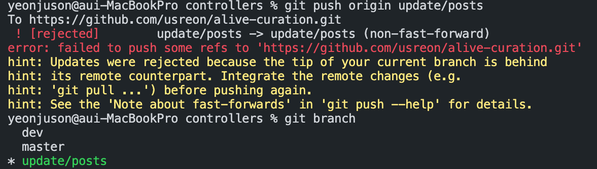

## 오늘 배운 것

### 코드의 재사용성

코드를 작성할 때 함수의 재사용성을 염두하자. 공통된 기능을 미리 만들어 놓고 다시 만들지 않고 계속해서 프로젝트마다 재사용하는걸 보일러 플레이트라고 한다. 우리가 포스팅을 하는 기능을 만들려고 했을 때, 먼저 로그인이 되어있는지 확인해야 한다. 그런데 이 '로그인이 되어있는지 확인하는 함수'는, 회원 정보를 수정할 때 회원 탈퇴를 할 때 등 여러 기능에서 중복으로 쓰이는 것이다. 따라서 포스팅 하는 함수에서 if문으로 처리하는 대신 개별적으로 로그인 상태인지 확인하는 함수를 따로 만들어서 필요시에 호출하여 사용하도록 하자.

### git

깃 플로우상 브랜치가 뒤에 있다는 오류 메세지가 뜨면서 origin 개인브랜치에 push가 안 될 때는 끝에 -f만 붙여서 푸쉬한다. 하지만, **dev에는 절대 강제로 푸쉬하지 않도록 한다.**

> git push origin 브랜치이름 -f

### SR기획 피드백
