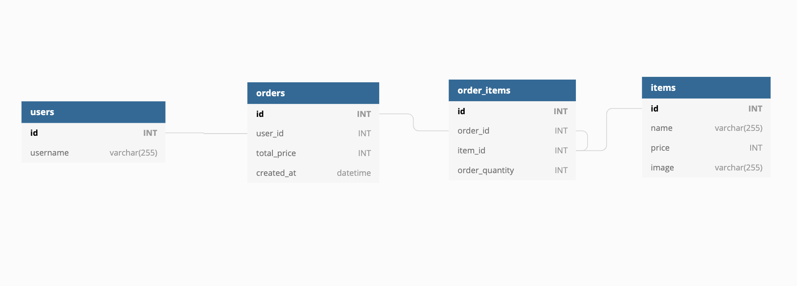

[Node.js MySQL](https://www.w3schools.com/nodejs/nodejs_mysql_insert.asp) 참고하며 코드 적기

### 여러 레코드 추가
둘 이상의 레코드를 삽입하려면 값을 포함하는 배열을 만들고 sql에 물음표를 삽입합니다. 이 물음표는 값 배열로 대체됩니다.
`INSERT INTO customers (name, address) VALUES ?`

### 결과 객체
```js
{
  fieldCount: 0,
  affectedRows: 14,
  insertId: 0, // 자동 증가 ID 필드가 있는 테이블의 경우 결과 개체를 요청하여 방금 삽입한 행의 ID를 얻을 수 있습니다.
  serverStatus: 2,
  warningCount: 0,
  message: '\'Records:14  Duplicated: 0  Warnings: 0',
  protocol41: true,
  changedRows: 0
}
```


## 스키마.sql



### 직접 코드 작성하기
```js
const db = require('../db');

module.exports = {
    post: async (userId, orders, totalPrice, callback) => {
      // TODO: 해당 유저의 주문 요청을 데이터베이스에 생성하는 함수를 작성하세요
      
      const query1 = `INSERT INTO orders (user_id, total_price) VALUES (${userId}, ${totalPrice})`
      const query2 = `INSERT INTO order_items (order_id, item_id, order_quantity) VALUES ?` 

      let orderId;
      await new Promise ((res, rej) => {
        db.query(query1, (err, result) => {
          orderId = result.insertId;
          if (err) rej(err);
          res(result);
          })
        });

      const mappedOrders = orders.map((el) => {
        return [orderId, el.itemId, el.quantity];
      });

      db.query(query2 ,[mappedOrders], (err, result) => {
          callback(err, result);
      });
    }
}
```