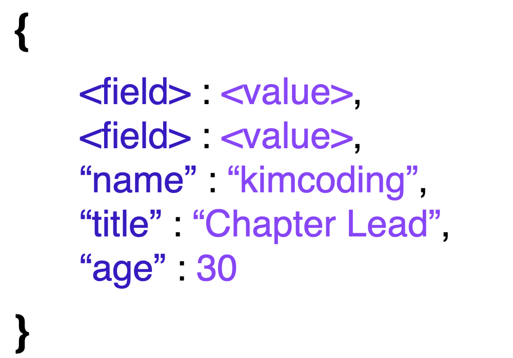
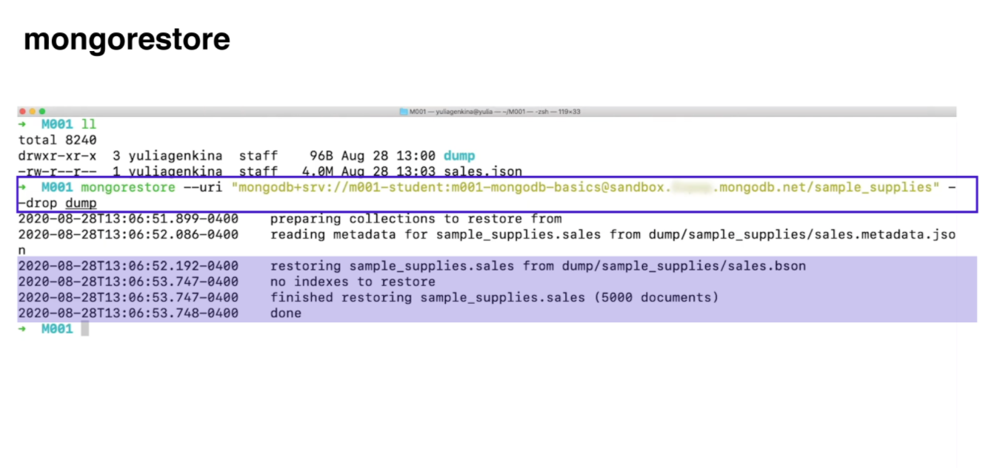

# Goal 
> 먼저 MongoDB가 무엇인지 알아본 후, 데이터를 다루는 방법을 학습합니다. 이 챕터에서 데이터가 구성되는 방법, 데이터베이스에 쿼리를 사용하고 저장하는 방법과 함께 인덱싱과 같은 고급 개념까지 학습합니다. 

# 데이터베이스의 종류
## 1. Relational
데이터의 세상을 테이블로 보았다. FK로 테이블을 묶어서 데이터를 수정해주면 엮어놓은 다른 테이블의 데이터 또한 자동으로 변하기 때문이다. 하지만 우리는 객체를 가지고 코딩을 하기 때문에 mongoDB 보다 덜 직관적이다. mongoDB는 객체를 가지고 코딩을 한다. <br>
중요한 것은 우리가 다룰 어플리케이션에 필요한 데이터베이스의 종류를 데이터의 종류와 양에 따라 찾는 게 중요하다. 

### SQL (mysql, postgresql, sqlite...)
관계형 데이터 베이스와 대화하기 위해 특별히 디자인 된 언어


## 2. Non-Relational
### NoSQL 
관계형 테이블의 레거시(낡은 기술이나 방법론, 컴퓨터 시스템, 소프트웨어)한 방법을 사용하지 않는 데이터 저장소를 말한다. 따라서, NoSQL 데이터베이스에서는 데이터를 행과 열이 아닌 체계적인 방식으로 저장한다. <br>

MongoDB는 데이터를 도큐먼트의 형태로 저장한다. 정리하자면, MongoDB 데이터베이스는 NoSQL 도큐먼트 데이터베이스이다.

### NoSQL 기반의 비관계형 데이터베이스는 다음과 같은 경우에 많이 사용한다.
1. 비구조적인 대용량의 데이터를 저장하는 경우 : 유연한 스키마
SQL 데이터베이스보다 자유로운 형태로 데이터를 저장할 수 있으므로 필요에 따라서 새로운 데이터 유형을 추가할 수 있다. 소프트웨어 개발에 정형화되지 않은 많은 양의 데이터가 필요한 경우 사용한다.<br>

예를 들어, SQL에서는 스키마를 픽스해놔야 한다. 하지만 새로운 아이디어가 떠올라서 스키마를 바꾸고 싶을 때에는 SQL에선 어렵다. 하지만 No SQL 에서는 변경이 유연하다. 


2. 클라우드 컴퓨팅 및 저장공간을 최대한 활용하는 경우 : 수평적 확장에 용이
데이터베이스를 클라우드 기반으로 쉽게 분리 할 수 있도록 지원하여, 저장 공간을 효율적으로 사용한다. 시스템이 커지면서 DB를 증설해야 하는 시점이 오면, SQL 데이터베이스에서는 수직적 확장의 형태로 DB를 증설한다. 수직적으로 확장된 데이터베이스는 관리가 어려워질 수 있는데에 반해, NoSQL은 수평적 확장의 형태로 증설하므로, 이론상 무한대로 서버를 계속 분산시켜 DB를 증설할 수 있다. NoSQL에서는 SQL처럼 테이블을 JOIN할 필요없이 도큐먼트에 계속 넣으면 된다.

3. 빠르게 서비스를 구축하고 데이터 구조를 자주 업데이트 하는 경우
NoSQL 데이터베이스의 경우 스키마를 미리 준비할 필요가 없어서, 개발을 빠르게 해야하는 경우에 매우 적합하다. 시장에 빠르게 프로토타입을 출시해야 하는 경우나, 소프트웨어 버전별로 많은 다운타임(데이터베이스의 서버를 오프라인으로 전환하여 작업하는 시간) 없이 데이터 구조를 자주 업데이트 해야하는 경우에는 일일이 스키마를 수정해주어야 하는 관계형 데이터베이스 보다 NoSQL 기반의 비관계형 데이터베이스가 더 효율적이다.

## [MongoDB](https://poiemaweb.com/mongdb-basics) 
### Atlas Cloud
MongoDB에서는 아틀라스(Atlas)로 클라우드에 데이터베이스를 설정한다.<br>
아틀라스는 GUI와 CLI로 데이터를 시각화, 분석, 내보내기, 그리고 빌드하는 데에 사용할 수 있다. 아틀라스 사용자는 클러스터를 배포 할 수 있으며, 클러스터는 그룹화된 서버에 데이터를 저장한다.


+ 레플리카 세트
동일한 데이터를 저장하는 소수의 연결된 머신. 레플리카 세트 중 하나에 문제가 발생하더라도, 데이터를 그대로 유지할 수 있다.
+ 인스턴스
로컬 또는 클라우드에서 특정 소프트웨어를 실행하는 단일 머신, MongoDB에서는 데이터베이스이다.
+ 클러스터 
데이터를 저장하는 서버 그룹으로 여러 대의 컴퓨터를 네트워크를 통해 연결하여 하나의 단일 컴퓨터처럼 동작하도록 제작한 컴퓨터를 뜻한다.

이 서버는 레플리카 세트(Replica set)로 구성되어 있으며, 레플리카 세트는 동일한 데이터를 저장하는 몇 개의 연결된 MongoDB 인스턴스의 모음이다.

#### how does it work?
인스턴스는 특정 소프트웨어를 실행하는 로컬 또는 클라우드의 단일 머신이다. 여기서 인스턴스는 클라우드에서 실행되는 MongoDB 데이터베이스이다. 인스턴스에서 도큐먼트나 컬렉션을 변경할 경우, 변경된 데이터의 중복 사본이 레플리카 세트에 저장된다. 이 설정 덕분에 레플리카 세트의 인스턴스 중 하나에 문제가 발생하더라도 데이터는 그대로 유지되며, 레플리카 세트의 애플리케이션에서 나머지 작업을 할 수 있다. 이 과정을 위해 클러스터(서버 그룹)를 배포하면, 자동으로 레플리카 세트가 구성된다.

### MongoDB Document
MongoDB에서 도큐먼트가 무엇인지, 도큐먼트로 데이터를 어떻게 체계적인 방법으로 저장하는지 살펴보자. 도큐먼트는 객체와 같이 데이터를 필드-값 쌍(Field - Value pair)으로 저장하고 구성한다. 도큐먼트에서 필드는 데이터의 고유한 식별자이고, 값은 주어진 식별자와 관련된 데이터를 뜻한다.


위 예제에서 name이란 필드의 값은 kimcoding이다. 이러한 도큐먼트의 모음을 컬렉션이라고 한다. 그리고 데이터베이스는 여러개의 컬렉션으로 구성된다.

+ 도큐먼트(Document)
필드 - 값 쌍으로 저장된 데이터

+ 필드(Field)
데이터 포인트를 위한 고유한 식별자

+ 값(Value)
주어진 식별자와 연결된 데이터

+ 컬렉션(Collection)
MongoDB의 도큐먼트로 구성된 저장소. 일반적으로 도큐먼트 간의 공통 필드가 있다. 데이터베이스 당 많은 컬렉션이 있고, 컬렉션 당 많은 도큐먼트가 있을 수 있다.


### JSON vs BSON
> 도큐먼트(Document)를 올바르게 작성하는 방법과 도큐먼트(Document)가 표현 되는 방법을 학습합니다.

#### JSON (JavaScript Object Notation)
shell을 이용하여 도큐먼트를 조회하거나 업데이트 할 때, 도큐먼트는 JSON(JavaScript Object Notation) 형식으로 출력된다. JSON 형식으로 도큐먼트를 작성하기 위해서는, 다음과 같은 조건을 만족해야 한다.

+ {} 중괄호로 도큐먼트가 시작하고, 끝나야 합니다.
+ 필드와 값이 콜론(:)으로 분리되어야 하며, 필드와 값을 포함하는 쌍은 쉼표(,)로 구분됩니다.
+ 문자열인 필드도 쌍따옴표("")로 감싸야 합니다.

```js
{
    "_id" : "12345",
    "date" : ISODate("2021-09-05T16:32:00Z"),
    "listing_id" : "567",
    "reviewer_id" : "8910",
    "comments" : "Hi i'm yeonju"
}
```

JSON은 텍스트 형식이기 때문에 읽기 쉽지만, 파싱이 느리고 메모리 사용이 비효율적이다. 그리고 JSON은 기본 데이터 타입만을 지원하기 때문에, 사용 할 수 있는 데이터 타입에 제약이 있다.

이런 문제점을 해결하기 위한 방안으로 BSON(Binary JSON) 형식을 도입하였다.

#### BSON


BSON은 컴퓨터의 언어에 가까운 이진법에 기반을 둔 표현법이다 따라서 JSON 보다 메모리 사용이 효율적이며 빠르고, 가볍고, 유연하다. 뿐만 아니라, BSON의 사용으로 더 많은 데이터 타입을 사용할 수 있다.<br>

MongoDB는 JSON형식으로 작성된 것은 무엇이든 데이터베이스에 추가할 수 있고, 쉽게 조회할 수 있다. 그러나 그 내부에서는 속도, 효율성, 유연성의 장점이 있는 BSON으로 데이터를 저장, 사용하고 있다.


### Importiong & Exporting
>이번 챕터에서는 데이터를 어떤 로컬 장치나 다른 시스템으로 내보내거나, 혹은 가져온다고 가정 했을때, 데이터 형식(JSON, BSON)에 따라 달라지는 import, export 명령어에 대해서 알아보도록 하겠습니다. 

데이터를 가져오거나(import), 내보내는(export) 경우에 따라 효율적인 데이터 형식이 존재한다. MongoDB의 데이터는 BSON의 형태로 저장이 되고, 보통 읽기 쉬운 JSON의 형태로 출력된다. <Br>

만약 단순히 백업 저장을 하기 위해서라면 가볍고 빠른 BSON의 형태를 사용하는 편이 좋다. 그러나 데이터를 내보낸 후, 조회를 하거나 출력을 해야한다면 사람이 읽기 쉬운 JSON의 형식이 바람직하다. 그래서 조건에 따라, 가져오거나 내보낼 때 사용 가능한 명령어가 각각 존재한다. 이는 사용하기 위해서 Atlas Cluster URI가 필요하다. (해당 URI는 일반 웹의 URI와 형식이 같고, username, password, cluster 주소로 이루어져있다.)

+ mongoimport & mongoexport 
  - JSON 형식으로 데이터를 가져오고 내보내기 위한 명령어 
  - mongodump를 하는 경우에는 별다른 쿼리가 없지만 mongoexport를 하는 경우에는해당 데이터베이스의 컬렉션 이름, 파일 이름까지 정확하게 작성해줘야 한다. 
+ mongorestore & mongodump
BSON 형식으로 가져오고 내보내기 위한 명령어 



### mongo DB CRUD