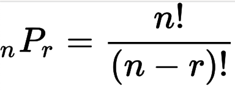

## 순열과 조합
이 둘을 구분해서 쓰는 것이 핵심이다. 조합의 논리를 순열에서 쓰고 있다.

### 순열

1. 뽑는 대상은 서로 다른 n개
2. 뽑는 개수 : r개
3. 뽑을 때 중복x // 뽑은 걸 또 뽑는 거x
4. 순서의 구분(O) // a,b b,a가 다른 의미를 가진다.

### 조합
1. 대상 : 서로 다른 n개
2. 개수 : r개
3. 중복 x
4. 순서의 구분(X)

GCD/LCM
멱집합