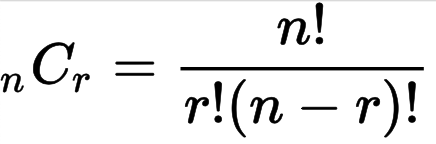

## 순열과 조합
이 둘을 구분해서 쓰는 것이 핵심이다. 조합의 논리를 순열에서 쓰고 있다.

### 순열

1. 뽑는 대상은 서로 다른 n개
2. 뽑는 개수 : r개
3. 뽑을 때 중복x // 뽑은 걸 또 뽑는 거x
4. 순서의 구분(O) // a,b b,a가 다른 의미를 가진다.  

#### 순열 문제 예시
>한 자리 숫자가 적힌 종잇조각이 흩어져 있습니다. 흩어진 종잇조각을 붙여 소수를 몇 개 만들 수 있는지 알아내려 합니다. 종이에 기록된 모든 숫자가 배열로 주어진다면, 이 종잇조각으로 만들 수 있는 소수는 몇 개인가요?

순서의 구분이 있으니 순열로 풀어야 하는 문제다.  

+ n 개의 숫자 중에 1~k 개를 뽑아서 순열을 생성
+ 각 순열을 정수로 변환하고, 해당 정수가 중복되지 않으면서 동시에 소수인지 검사
+ 소수이면 개수를 센다
+ 숫자는 순서에 의해 전혀 다른 값이 될 수 있다. 예를 들어 123과 321은 전혀 다른 숫자이다. 만약 이 문제를 조합으로 접근하게 된다면, 123과 321은 같은 경우로 취급하게 된다. 따라서, 순서를 고려하지 않고 k 개를 뽑아내는 조합으로는 이 문제를 해결할 수 없다.

### 조합

1. 대상 : 서로 다른 n개
2. 개수 : r개
3. 중복 x
4. 순서의 구분(X)  

#### 순열 문제 예시
>왕비를 피해 일곱 난쟁이와 함께 평화롭게 생활하고 있던 백설 공주에게 위기가 찾아왔습니다. 하루일과를 마치고 돌아온 "일곱" 난쟁이가 "아홉" 명이었던 겁니다. 아홉 명의 난쟁이는 모두 자신이 "백설 공주와 일곱 난쟁이"의 주인공이라고 주장했습니다. (뛰어난 수학적 직관력을 가지고 있던) 백설 공주는 일곱 난쟁이의 키의 합이 100임을 기억해 냈습니다. 아홉 난쟁이 각각의 키가 주어질 때, 원래 백설 공주와 평화롭게 생활하던 일곱 난쟁이를 찾는 방법은 무엇인가요?

위 문제는 조합을 이용해서 일곱 난쟁이를 찾을 수 있다. 모든 일곱 난쟁이의 키를 합했을 때 100이 된다고 주어졌기 때문에, 9명의 난쟁이 중 7명의 난쟁이를 순서를 생각하지 않고, 난쟁이 7명의 키를 합했을 때 100이 되는 경우를 찾으면 된다.

## GCD/LCM
+ 약수: 어떤 수를 나누어떨어지게 하는 수
+ 배수: 어떤 수의 1, 2, 3, ...n 배하여 얻는 수
+ 공약수: 둘 이상의 수의 공통인 약수
+ 공배수: 둘 이상의 수의 공통인 배수
+ 최대 공약수(GCD. Greatest Common Divisor): 둘 이상의 공약수 중에서 최대인 수
+ 최소 공배수(LCM. Least Common Multiple): 둘 이상의 공배수 중에서 최소인 수

## 멱집합